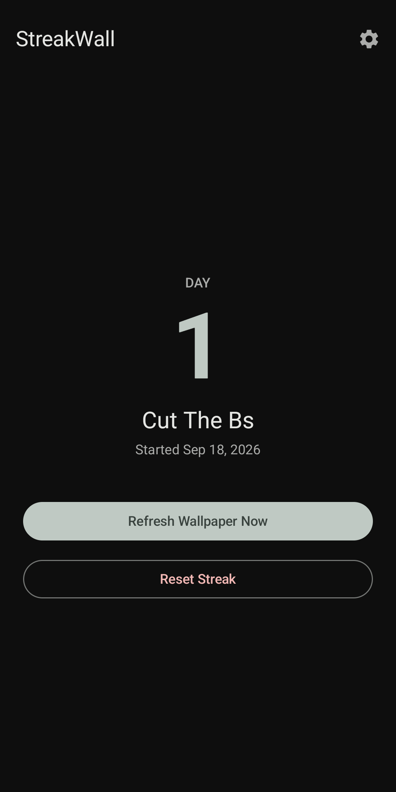

# StreakWall

A habit and streak tracker that puts your progress on your wallpaper. Name the goal you're working on (quitting smoking, cutting sugar, a daily workout), pick a start date, and StreakWall redraws your home and lock screen wallpaper every midnight to show **Day N**, so the streak is the first thing you see each time you pick up your phone.

<p align="center">
  
</p>

## Features

- **Any habit.** You name your own goal during onboarding; nothing is hardcoded.
- **Wallpaper that updates itself.** Drawn at your device's real screen resolution and applied to both the home and lock screens just after local midnight.
- **Milestones.** Days 7, 30, 90 and 365 get a distinct accent color and badge.
- **Themes.** Choose a wallpaper style (Midnight, Forest, Sunset, Monochrome).
- **Hard to lose by accident.** Resetting a streak requires confirming a dialog.
- **Private by design.** Everything stays on your device. No account, no analytics, no network access.
- Material 3 UI with dynamic color and dark mode.

## How it works

| Piece | Implementation |
| --- | --- |
| UI | Jetpack Compose, Material 3, Navigation Compose |
| State | ViewModels backed by a repository over Jetpack DataStore (Preferences) |
| Day counting | `java.time.LocalDate` calendar-day math, safe across DST and timezone changes |
| Wallpaper | `Bitmap` + `Canvas` sized from real display metrics, applied with `WallpaperManager` (`FLAG_SYSTEM` and `FLAG_LOCK`) |
| Scheduling | WorkManager: a one-time job that queues the next one for the following midnight, re-armed on app start and after reboot |

The daily job recalculates its delay from the current clock and timezone each time, so it stays correct on 23 and 25 hour DST days. Between runs the app holds no wake locks, alarms or services.

## Building

Requirements: JDK 17 and the Android SDK (platform 35, build-tools 34+). Point Gradle at your SDK with a `local.properties` file (git-ignored):

```
sdk.dir=/path/to/Android/Sdk
```

```bash
./gradlew :app:testDebugUnitTest   # unit tests
./gradlew :app:assembleDebug       # app/build/outputs/apk/debug/app-debug.apk
```

Install on a connected device with USB debugging enabled:

```bash
adb install -r app/build/outputs/apk/debug/app-debug.apk
```

The debug build installs as `com.console.streakwall.debug`, so it can sit alongside a release build.

## Release signing

Release signing reads a git-ignored `keystore.properties` in the project root. Copy `keystore.properties.example` to `keystore.properties` and fill in your own keystore details. Without that file, the release build type produces an unsigned APK, so the project still builds on a fresh checkout.

## Project layout

```
app/src/main/java/com/console/streakwall/
├── data/        DataStore repository, preferences model, wallpaper themes
├── util/        Date math (DateUtils)
├── wallpaper/   Bitmap generation, WallpaperManager wrapper, WorkManager worker and scheduler
├── boot/        Boot receiver that re-arms the daily job
└── ui/          Compose screens (onboarding, home, settings, privacy) and navigation
```

## Privacy

StreakWall stores your goal name, start date and theme only in the app's private storage on your device. It requests two permissions: `SET_WALLPAPER` to draw your day count, and `RECEIVE_BOOT_COMPLETED` to resume the daily update after a restart. Uninstalling removes all of its data.
